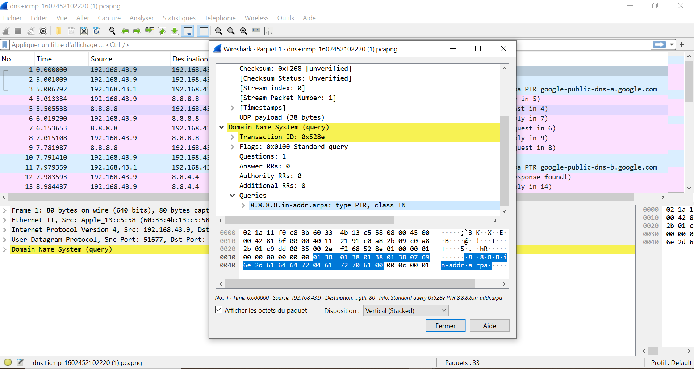
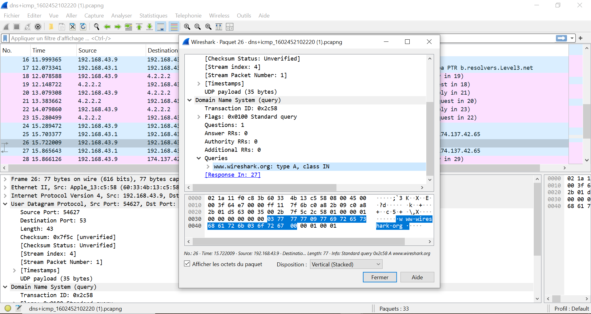

# 🌐 Task 10 - Analyse DNS (Wireshark 101)

## 🔍 Analyse des Requêtes DNS

### 📌 Paquet 1 (Query Reverse DNS)
  
- **Query** : `8.8.8.8.in-addr.arpa`  
- **Type** : PTR (Reverse DNS)  
- **Analyse** :  
  Résolution d'adresse IP (8.8.8.8) vers un nom de domaine.

### 📌 Paquet 26 (Standard DNS Query)
  
- **Query** : `www.wireshark.org`  
- **Transaction ID** : `0x2c58` (en hexa)  
- **Analyse** :  
  Requête DNS classique pour résoudre un domaine.

## 📚 Fichiers Inclus
- [Capture complète](captures/dns+icmp_1602452102220.pcapng)
- [Réponses THM](answers.txt)