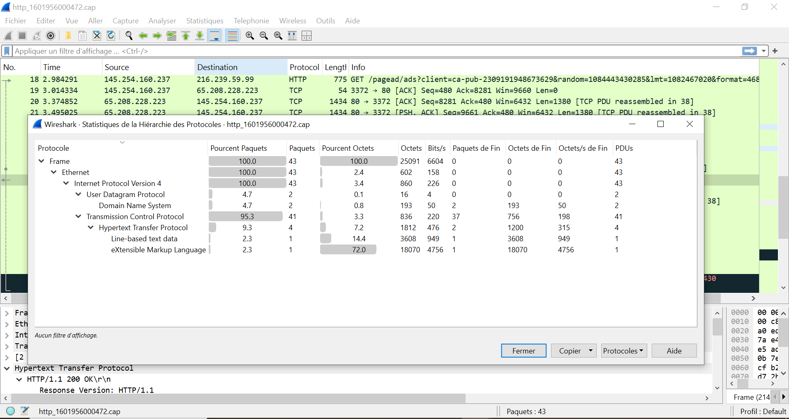
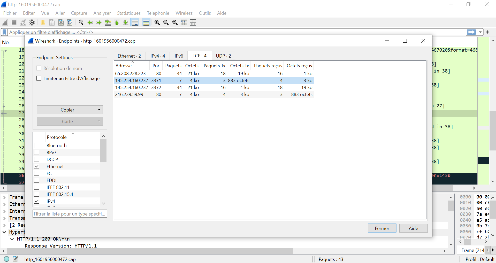
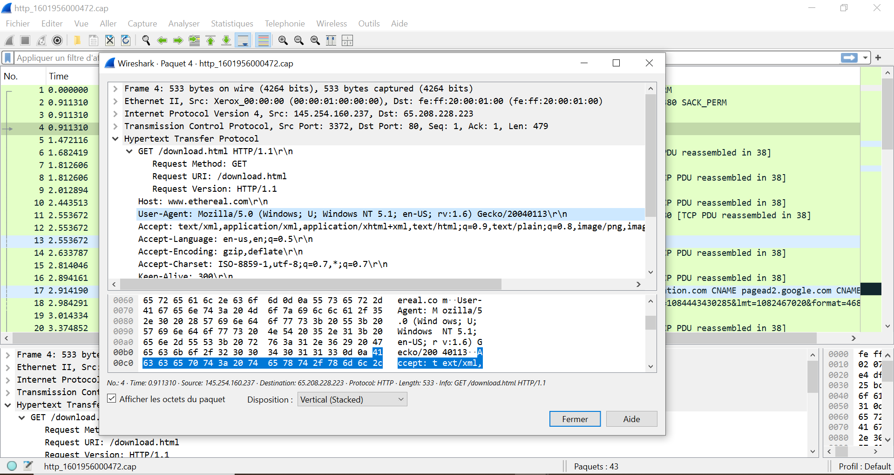
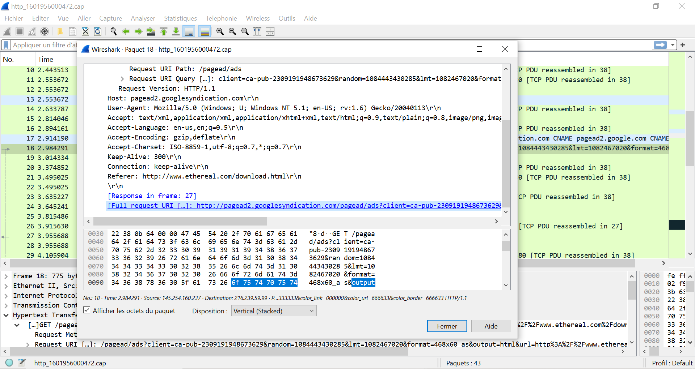
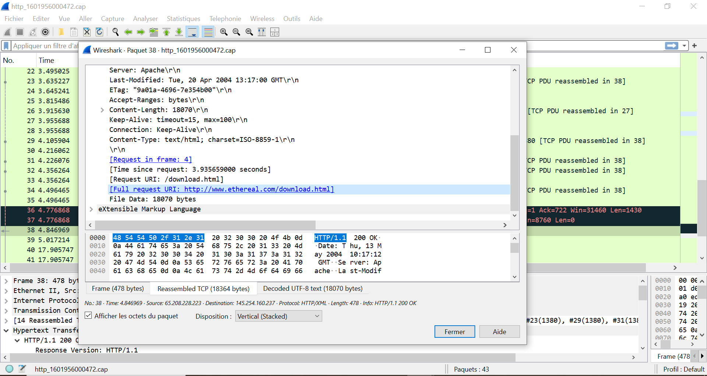

# 🌐 Task 11 - Analyse HTTP (Wireshark 101)

## 🔍 Analyse du Trafic HTTP

### 📌 Statistiques Protocoles
  
- **DNS** : 4.7% des paquets  
- **Analyse** :  
  Pourcentage des requêtes DNS dans la capture.

### 📌 Endpoints Réseau
  
- **Endpoint .237** : `145.254.160.237`  
- **Analyse** :  
  Adresse IP finale identifiée via Statistics > Endpoints.

### 📌 Paquet 4 (User-Agent)
  
- **User-Agent** :  
  `Mozilla/5.0 (Windows; U; Windows NT 5.1; en-US; rv:1.6) Gecko/20040113`  
- **Analyse** :  
  Navigateur ancien (Windows XP) utilisé pour la requête.

### 📌 Paquet 18 (Requête complète)
  
- **URI** :  
  `http://pagead2.googlesyndication.com/pagead/ads?client=ca-pub-2309191948673629&random=1084443430285...`  
- **Analyse** :  
  Requête publicitaire Google avec multiples paramètres.

### 📌 Paquet 38 (Domaine + URI)
  
- **Domaine** : `www.ethereal.com`  
- **URI** : `http://www.ethereal.com/download.html`  
- **Analyse** :  
  Téléchargement depuis le site Ethereal (ancêtre de Wireshark).

## 📚 Fichiers Inclus
- [Capture HTTP originale](captures/http_1601956000472.cap)
- [Réponses THM](answers.txt)

## 🛠️ Fonctions Wireshark Clés
```bash
Statistics > Protocol Hierarchy  # Pourcentage DNS
Statistics > Endpoints           # IP .237
Ctrl+Alt+H                       # Export HTTP Objects
http.request.uri contains "goog" # Filtre pour paquet 18