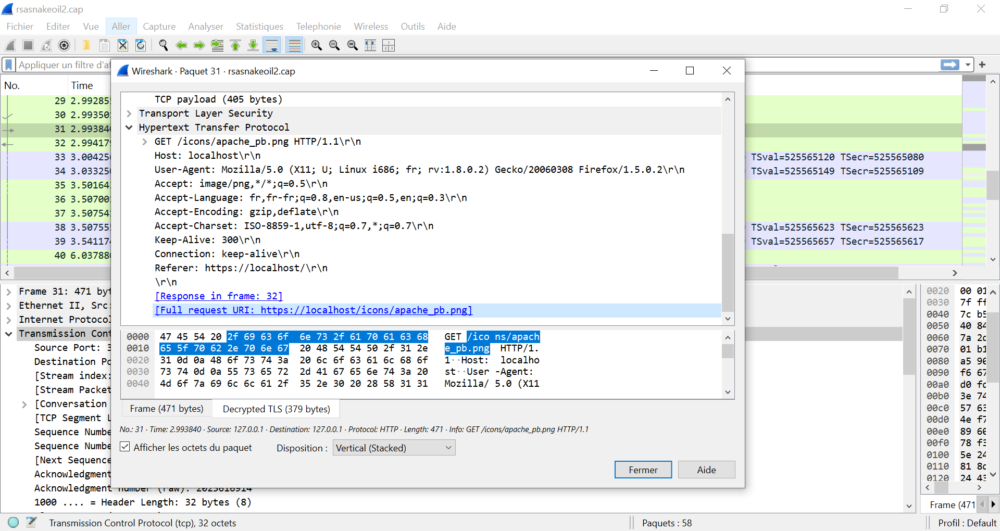
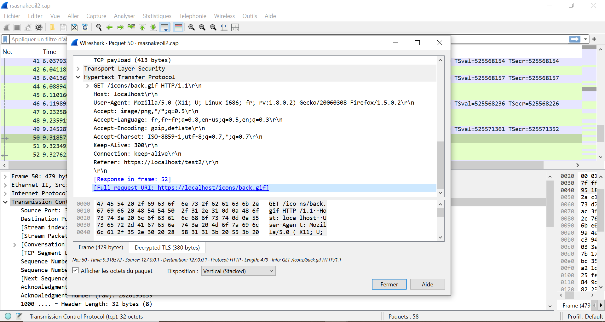

# 🔒 Task 12 - Analyse HTTPS (Wireshark 101)

## 🔍 Décryptage du Trafic HTTPS

### 📌 Configuration TLS dans Wireshark
  
- **Étapes** :  
  `Edit > Preferences > Protocols > TLS` → Ajout clé RSA  
- **Champs requis** :  
  - IP: `127.0.0.1`  
  - Port: `start_tls`  
  - Key File: `snakeoil2.key`  

### 📌 Requête décryptée (Paquet 31)
  
- **URI complète** :  
  `https://localhost/icons/apache_pb.png`  
- **Analyse** :  
  Image du logo Apache demandée après décryptage réussi.

## 📚 Fichiers Inclus
- [Capture HTTPS](captures/snakeoil2.pcap)  
- [Clé de décryptage](captures/snakeoil2.key)  
- [Réponses THM](answers.txt)  

## 🛠️ Commandes Utiles
```bash
# Filtrer les handshakes TLS
tls.handshake.type == 1   # Client Hello
ssl.handshake.type == 2   # Server Hello (anciennes versions Wireshark)

# Exporter les objets HTTP décryptés
File > Export Objects > HTTP