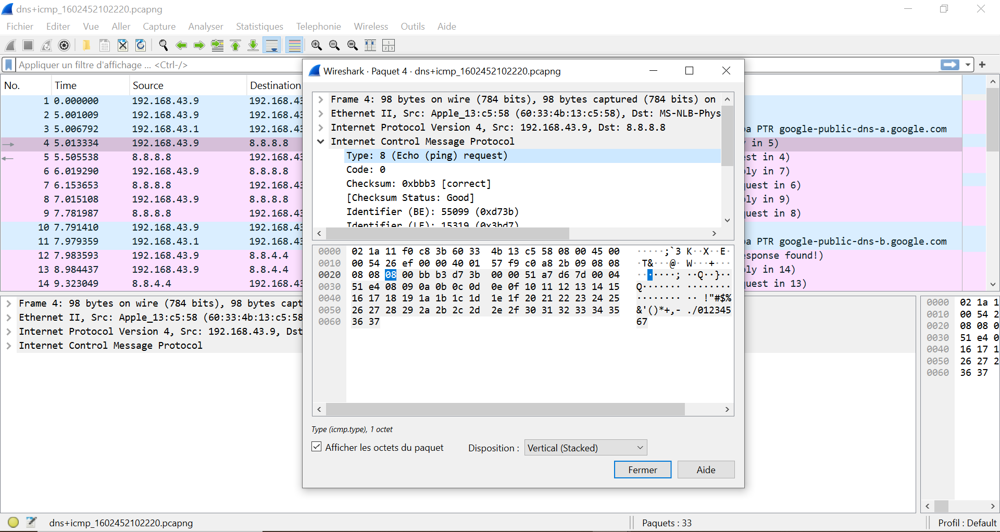

# 📡 Task 8 - Analyse ICMP (Wireshark 101)

## 🎯 Concepts Clés
- **Requêtes ICMP** (`Type=8`) vs **Réponses** (`Type=0`)
- **Timestamps** : Détection d'anomalies temporelles
- **Data Strings** : Analyse du contenu des paquets

## 🔎 Méthodologie
1. **Filtre Wireshark** : `icmp`
2. **Identification** :
   - Paquets suspects (ex: flood ICMP)
   - Timestamps incohérents
3. **Outils** : 
   - Statistiques → Flow Graph (pour visualiser les échanges)

## 📸 Preuves
| Question | Screenshot | Analyse |
|----------|------------|---------|
| Q1 (Type=8) |  | Requête ping classique |
| Q2 (Type=0) |  | Réponse du serveur |
| Q3 (Timestamp) |  | Date formatée |
| Q4 (Data) |  | Hexdump du payload |

## 📁 Fichiers
- [Capture PCAP](captures/task8.pcap)
- [Réponses THM](answers.txt)
