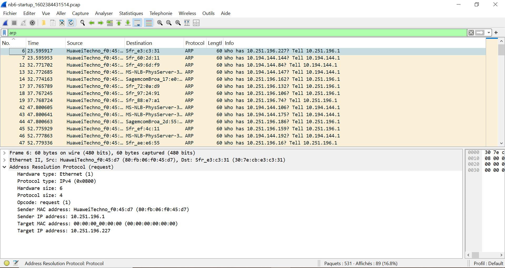

# 🔍 Task 7 - Analyse ARP (Wireshark 101)

## 📌 Résultats
- **Fichier analysé** : `task7.pcap`
- **Capture d'écran** :  
  

## 🎯 Réponses TryHackMe
Voir [answers.txt](answers.txt).

## 💡 Méthodologie
1. Filtre utilisé : `arp.opcode == 1` (requêtes ARP).
2. Identification des adresses MAC/IP.# Wireshark-THM-Labs
